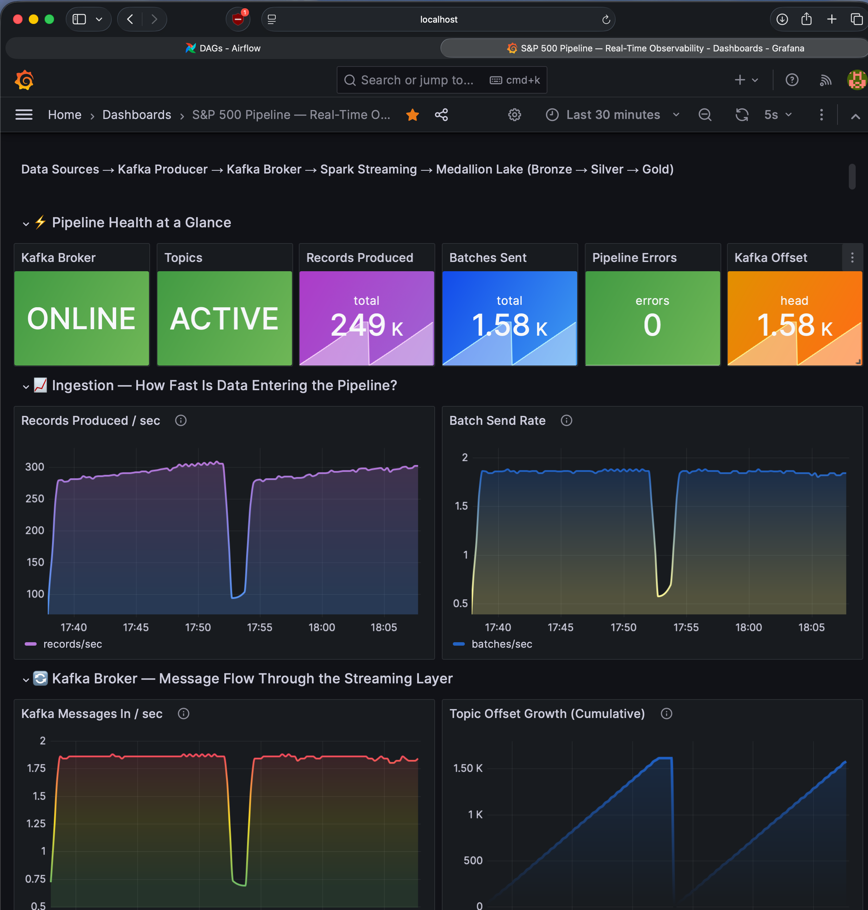
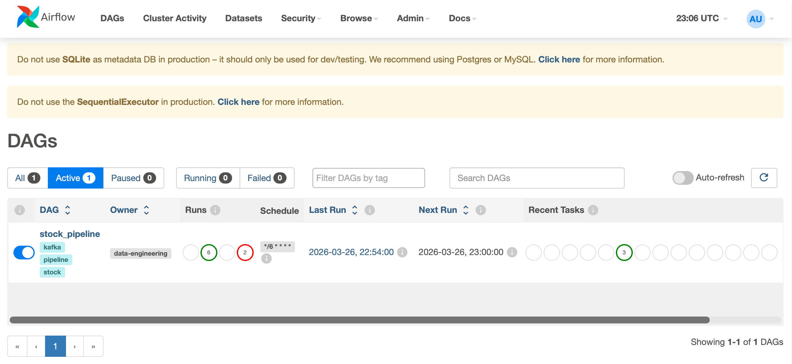

# Real-Time Stock Data Pipeline

End-to-end data engineering pipeline that ingests stock market data (live API + Kaggle S&P 500 dataset) using Apache Kafka and Apache Spark Structured Streaming, lands it in a medallion-architecture data lake (bronze/silver/gold), and visualizes insights through a Streamlit dashboard. Orchestrated by Airflow, monitored with Prometheus & Grafana, and provisioned with Terraform.

## Architecture

```
Data Sources
├── FinancialModelingPrep API (live)
└── Kaggle S&P 500 CSV (historical)
        |
   Kafka Producer (scheduled by Airflow, every 6 min)
        |
   Apache Kafka (Docker Compose locally / EC2 via Terraform)
        |
   Spark Structured Streaming
        |
   Data Lake (Local filesystem or S3)
   ├── Bronze (raw JSON, partitioned by ingestion date)
   ├── Silver (cleaned & deduplicated Parquet)
   └── Gold (aggregated metrics: daily summary, sector performance, top movers)
        |
   ┌────────────────────────────────┐
   │  Streamlit Dashboard           │
   │  ├── Price Trends              │
   │  ├── Sector Analysis           │
   │  ├── Top Daily Movers          │
   │  └── Index Correlation         │
   └────────────────────────────────┘
        |
   Prometheus + Grafana (monitoring)
```

## Monitoring & Orchestration

### Grafana — Real-Time Pipeline Observability



The Grafana dashboard tells the story of data flowing through the pipeline in real time:
- **Pipeline Health** — Kafka broker status, topic activity, error count
- **Ingestion Rate** — Records/sec and batches/sec with gradient visualizations
- **Kafka Broker** — Message throughput and cumulative offset growth
- **Throughput** — Total records produced with a progress gauge (% of 3768 trading days)
- **Reliability** — Error rate tracking and records-per-batch sanity checks

### Airflow — Pipeline Orchestration



The `stock_pipeline` DAG runs every 6 minutes:
1. **check_kafka_health** — Verifies Kafka broker is reachable
2. **run_producer** — Triggers data ingestion
3. **run_quality_checks** — Validates data across medallion layers

## Tech Stack

| Component        | Technology                          |
|------------------|-------------------------------------|
| Ingestion        | Python, `kafka-python-ng`, `requests` |
| Streaming        | Apache Kafka (Confluent Platform)   |
| Processing       | Apache Spark Structured Streaming   |
| Storage          | Local filesystem or AWS S3 (Parquet) |
| Orchestration    | Apache Airflow                      |
| Visualization    | Streamlit, Plotly                   |
| Monitoring       | Prometheus, Grafana, Kafka Exporter |
| Infrastructure   | Terraform, Docker Compose           |
| Data Quality     | Custom validation framework         |
| CI/CD            | GitHub Actions (lint, test, terraform validate, docker build) |

## Dataset

Kaggle S&P 500 dataset (`data/`):
- **sp500_stocks.csv** — ~618K rows of daily OHLCV prices for S&P 500 stocks (2010-2024)
- **sp500_companies.csv** — 503 companies with sector, industry, market cap, revenue growth
- **sp500_index.csv** — S&P 500 index daily values (2014-2024)

## Quick Start

### Prerequisites
- Docker & Docker Compose
- Python 3.11+
- Java 17+ (for running PySpark tests locally)

### Local Development

1. **Clone and configure:**
   ```bash
   git clone <repo-url>
   cd KAFKA_AWS_EC2_DATA_PIPELINE
   cp .env.example .env
   ```

2. **Start the full stack:**
   ```bash
   docker compose up -d
   ```
   This starts Zookeeper, Kafka, Spark consumer, producer (CSV mode), Airflow, Streamlit dashboard, Prometheus, and Grafana.

   The pipeline runs fully locally — no AWS credentials needed. Data lands in `./output/` as Parquet files in the medallion layout.

3. **Access services:**
   | Service | URL | Credentials |
   |---------|-----|-------------|
   | Streamlit Dashboard | http://localhost:8501 | — |
   | Airflow UI | http://localhost:8080 | admin / admin |
   | Grafana | http://localhost:3000 | admin / admin |
   | Prometheus | http://localhost:9090 | — |
   | Spark UI | http://localhost:4040 | — |
   | Kafka broker | localhost:9092 | — |

4. **Run tests:**
   ```bash
   pip install -r requirements-test.txt
   pytest tests/ -v --cov=src
   ```

5. **Lint:**
   ```bash
   ruff check src/ tests/ dags/
   ```

### AWS Deployment

1. **Set AWS credentials** in `.env`:
   ```
   STORAGE_MODE=s3
   AWS_ACCESS_KEY_ID=...
   AWS_SECRET_ACCESS_KEY=...
   S3_BUCKET=your-bucket-name
   ```

2. **Provision infrastructure:**
   ```bash
   cd terraform
   terraform init
   terraform plan -var="key_pair_name=your-key"
   terraform apply -var="key_pair_name=your-key"
   ```

3. **Tear down:**
   ```bash
   ./scripts/teardown.sh
   ```

## Data Lake Layout

```
output/ (local) or s3://<bucket>/ (AWS)
├── bronze/stocks/       # Raw JSON from Kafka, partitioned by ingestion time
├── silver/stocks/       # Cleaned Parquet — nulls filtered, daily returns added
├── gold/stocks/         # Aggregated: daily summary, sector performance
├── dead_letter/         # Quarantined bad records
└── checkpoints/         # Spark streaming checkpoints
```

## Data Quality

Validation runs between each medallion layer:
- **Bronze**: Non-null JSON payload
- **Silver**: Positive price, non-empty symbol, no duplicates, percentage within bounds
- **Gold**: Non-empty aggregation output, row count sanity

Failed records are quarantined to the `dead_letter/` path.

## CI/CD

GitHub Actions (`.github/workflows/ci.yml`) runs on every push/PR to `main`:
1. **Lint** — `ruff check` on all Python code
2. **Test** — `pytest` with coverage reporting (20 tests across producer, transformations, quality checks)
3. **Terraform Validate** — Ensures infrastructure config is valid
4. **Docker Build** — Verifies all container images build successfully

## Project Structure

```
├── src/
│   ├── config.py              # Environment-based configuration
│   ├── schemas.py             # Spark schema definitions (API + Kaggle)
│   ├── producer.py            # Kafka producer (API or CSV mode)
│   ├── consumer.py            # Spark streaming consumer (Kafka -> local/S3)
│   ├── transformations.py     # Bronze -> Silver -> Gold transforms
│   ├── metrics.py             # Prometheus metrics exposition
│   ├── dashboard.py           # Streamlit dashboard
│   └── quality/
│       └── checks.py          # Data quality validation
├── dags/
│   └── stock_pipeline_dag.py  # Airflow DAG
├── terraform/                 # AWS infrastructure (S3, EC2, IAM)
├── monitoring/
│   ├── prometheus/prometheus.yml
│   └── grafana/               # Datasource, dashboard provisioning
├── tests/
│   ├── test_producer.py            # Producer unit tests (API + Kafka mocks)
│   ├── test_transformations.py     # API transform tests (bronze/silver/gold)
│   ├── test_sp500_transformations.py  # S&P 500 transform tests
│   └── test_quality.py             # Data quality validation tests
├── images/                    # Screenshots for documentation
├── .github/workflows/ci.yml  # CI pipeline
├── docker-compose.yml         # Full-stack local development
├── Dockerfile.spark           # Spark consumer container
├── Dockerfile.producer        # Producer container
├── Dockerfile.dashboard       # Streamlit dashboard container
├── requirements.txt           # Full Python dependencies
└── requirements-test.txt      # Lightweight test dependencies
```

## Configuration

All config lives in `src/config.py` and is loaded from environment variables. See `.env.example` for the full list.

| Variable | Description | Default |
|----------|-------------|---------|
| `KAFKA_BOOTSTRAP_SERVERS` | Kafka broker address | `localhost:9092` |
| `KAFKA_TOPIC` | Topic name for stock data | `test_kafka_aws` |
| `PRODUCER_MODE` | `api` (live) or `csv` (Kaggle) | `csv` |
| `STORAGE_MODE` | `local` or `s3` | `local` |
| `API_KEY` | FinancialModelingPrep API key | — |
| `S3_BUCKET` | Target S3 bucket name | `stock-pipeline-data` |
| `LOCAL_DATA_DIR` | Local output directory | `/app/output` |

Inside Docker Compose, Kafka internal listener is `kafka:29092`; external is `localhost:9092`.
